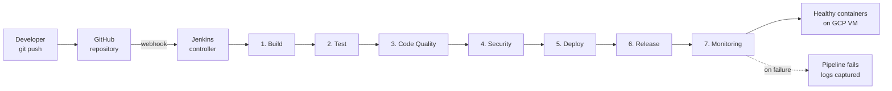

# Tours Booking Platform: Inka Planet Adventure

> A full-stack DevSecOps reference project for **SIT753 (Professional Practice in Information Technology)** (7.3HD Distinction Task).
> The platform powers tour discovery and online bookings for the Peruvian travel agency *Inka Planet Adventure*, and ships with an end-to-end Jenkins CI/CD pipeline running on a Google Cloud Compute VM.

[](#-jenkins-cicd-pipeline)
[](#-automated-testing)
[](#-security-scanning-with-trivy)
[](#-docker-setup)
[](#-technologies-used)

---

## Table of Contents

1. [Project Overview](#1-project-overview)
2. [Architecture Overview](#2-architecture-overview)
3. [Technologies Used](#3-technologies-used)
4. [Features](#4-features)
5. [Folder Structure](#5-folder-structure)
6. [Installation Instructions](#6-installation-instructions)
7. [Running Locally](#7-running-locally)
8. [Docker Setup](#8-docker-setup)
9. [Jenkins CI/CD Pipeline](#9-jenkins-cicd-pipeline)
10. [Pipeline Stages Explanation](#10-pipeline-stages-explanation)
11. [Automated Testing](#11-automated-testing)
12. [Security Scanning with Trivy](#12-security-scanning-with-trivy)
13. [Deployment Workflow](#13-deployment-workflow)
14. [API Endpoints](#14-api-endpoints)
15. [Screenshots](#15-screenshots)
16. [Future Improvements](#16-future-improvements)
17. [Conclusion](#17-conclusion)
18. [Author Information](#18-author-information)

---

## 1. Project Overview

The **Tours Booking Platform** is a production-style web application that allows travellers to browse tour packages offered by *Inka Planet Adventure*, review their itineraries, and submit booking requests with a confirmation email delivered through Resend.

Beyond the application itself, this project demonstrates a complete **DevSecOps workflow**: every push to GitHub triggers a Jenkins pipeline that builds the application, runs the automated test suite, performs code quality and vulnerability analysis, deploys the new version to a Google Cloud VM using Docker Compose, tags the release, and verifies that the running containers are healthy before reporting success.

The project is intentionally scoped to be small enough for a single-semester assessment, while exposing every meaningful DevSecOps surface: declarative pipeline syntax, containerised tests, image scanning, automated deployments triggered by webhooks, and post-deployment health verification.

---

## 2. Architecture Overview

The system is a classic two-tier web application packaged into two Docker images and orchestrated by Docker Compose on a single Linux host. Jenkins runs on the same Google Cloud VM and controls the lifecycle of those containers.

```
                ┌──────────────────────────────────────────────┐
                │              End user (browser)               │
                └──────────────────────┬────────────────────────┘
                                       │  HTTPS / HTTP
                                       ▼
┌──────────────────────────────────────────────────────────────────────┐
│                Google Cloud VM (Debian/Ubuntu, Docker)               │
│                                                                      │
│   ┌──────────────────────┐         ┌─────────────────────────────┐   │
│   │ Frontend container   │  /api/* │  Backend container          │   │
│   │  React + Vite SPA    │────────▶│  Node.js + Express API      │   │
│   │  served by nginx     │         │  Mock JSON data store       │   │
│   │  exposed :5173       │         │  exposed :5000              │   │
│   └──────────────────────┘         └─────────────┬───────────────┘   │
│                                                  │                   │
│                                                  ▼                   │
│                                       ┌─────────────────────┐        │
│                                       │  Resend API (HTTPS) │        │
│                                       │  booking emails     │        │
│                                       └─────────────────────┘        │
│                                                                      │
│   ┌──────────────────────────────────────────────────────────────┐   │
│   │  Jenkins controller (same VM, Docker-in-Docker workflow)     │   │
│   │   Build → Test → Code Quality → Security → Deploy →          │   │
│   │   Release → Monitoring                                       │   │
│   └──────────────────────────────────▲───────────────────────────┘   │
└──────────────────────────────────────┼───────────────────────────────┘
                                       │ webhook (push event)
                                       │
                ┌──────────────────────────────────────────────┐
                │                    GitHub                      │
                │      Source of truth, every push fires the      │
                │      Jenkins multibranch pipeline               │
                └──────────────────────────────────────────────┘
```

**Data flow at runtime**

1. The user opens the SPA at `https://<vm-host>:5173`. nginx serves the prebuilt static assets.
2. Any request to `/api/*` is reverse-proxied by nginx to the backend container at `http://backend:5000` on the internal Docker network.
3. The backend handles tour catalogue queries and booking submissions; valid bookings are persisted in-memory (placeholder for a future relational database) and an email is dispatched through the Resend REST API.
4. Each container exposes a healthcheck consumed by Docker Compose and by the Jenkins monitoring stage.

---

## 3. Technologies Used

| Layer                | Technology                          | Purpose                                                          |
|----------------------|-------------------------------------|------------------------------------------------------------------|
| Frontend SPA         | React 18, Vite 5, React Router 6    | Declarative UI, bundler/dev server, client-side routing          |
| Static serving       | nginx 1.27 (Alpine)                 | Serves the built SPA, reverse-proxies `/api` to the backend      |
| Backend API          | Node.js 20, Express 4               | REST endpoints for tours, addons, and bookings                   |
| Email delivery       | Resend Node SDK                     | Transactional booking confirmation emails                        |
| Validation           | Hand-rolled validator               | Structured `{ path, message }` error payloads on `POST` requests |
| Testing              | Jest 29, Supertest 7                | Unit + integration tests with JUnit and Cobertura reporting      |
| Containerisation     | Docker, Docker Compose v2           | Reproducible builds and orchestrated deploys                     |
| CI/CD                | Jenkins (declarative pipeline)      | Build, test, scan, deploy, release, monitor                      |
| Security scanning    | Trivy                               | Image-level CVE detection (HIGH/CRITICAL gating)                 |
| Code quality         | SonarCloud (placeholder)            | Maintainability and duplication analysis                         |
| Source control       | Git + GitHub                        | Versioning and webhook trigger for Jenkins                       |
| Hosting              | Google Cloud Compute VM             | Single-host Linux deployment target                              |

---

## 4. Features

**Customer-facing**

- Browse the public tour catalogue with category filtering (`Machu Picchu`, `Sacred Valley`, `Adventure`, `Day trip`, `Multi-day`).
- View a rich tour detail page with hero gallery, day-by-day itinerary, "what's included" lists, and a sticky pricing sidebar.
- Configure a booking (date, departure, passenger mix) and step through a guided four-step flow: *Tour and date* → *Passengers and extras* → *Contact* → *Confirmation*.
- Receive a confirmation email containing the booking code, dates, passengers, optional services and grand total, sent through Resend.

**Operational**

- Health endpoint (`GET /health`) for liveness probing and pipeline gating.
- Add-on services as a separate resource (`GET /api/addons`) so they can be expanded without redeploying the SPA.
- In-memory booking store keyed by an `IPA-YYYY-XXXXXX` code generator using `crypto.randomBytes`.

**DevSecOps**

- Containerised application with multi-stage Dockerfiles and non-root runtime user.
- Declarative Jenkins pipeline with seven stages.
- Test execution in a clean Node container, no host-level Node prerequisites.
- Container image vulnerability scanning with Trivy on every build.
- Automated webhook-triggered deployment on every push to `main`.
- Post-deployment health verification with retry and log capture on failure.

---

## 5. Folder Structure

```
tours-booking-platform/
├── backend/                          Express API
│   ├── __tests__/                    Jest + Supertest suites
│   │   ├── bookings.test.js          Happy path + validation matrix
│   │   ├── health.test.js
│   │   └── tours.test.js
│   ├── src/
│   │   ├── data/                     Mock JSON catalogue + repositories
│   │   ├── repositories/             In-memory persistence layer
│   │   ├── routes/                   /health, /api/tours, /api/addons, /api/bookings
│   │   ├── services/                 Booking, pricing, email
│   │   ├── utils/                    Booking-code generator
│   │   ├── validation/               Hand-rolled request validation
│   │   ├── app.js                    Express app factory
│   │   ├── config.js                 Env-var loader
│   │   └── server.js                 HTTP server bootstrap (dotenv)
│   ├── Dockerfile                    Production image (Node 20 Alpine, non-root)
│   ├── jest.config.js                JUnit + Cobertura reporters
│   ├── package.json                  npm scripts: dev / start / test / test:ci
│   └── .env.example                  Resend + server placeholders
├── frontend/                         React + Vite SPA
│   ├── public/                       Static assets
│   ├── src/
│   │   ├── api/                      Fetch clients (tours, bookings)
│   │   ├── components/
│   │   │   ├── booking/              Stepper, PassengerForm, AddonsList, …
│   │   │   └── …                     Cards, sidebar, gallery, layout
│   │   ├── pages/                    ToursListPage, TourDetailPage, BookingPage, …
│   │   ├── styles/index.css          Design tokens + IPA visual identity
│   │   ├── utils/format.js
│   │   ├── App.jsx
│   │   └── main.jsx
│   ├── Dockerfile                    Multi-stage build → nginx runtime
│   ├── nginx.conf                    SPA fallback + /api reverse proxy
│   ├── vite.config.js                Dev proxy to backend
│   └── package.json
├── docs/
│   ├── mockups/                      HTML mockups used for sprint reviews
│   └── user-stories/                 Sprint scope documents (S1, S2, S3)
├── docker-compose.yml                Two services + healthchecks + bridge network
├── Jenkinsfile                       Declarative pipeline, seven stages
└── README.md                         This file
```

---

## 6. Installation Instructions

### Prerequisites

| Tool                        | Minimum version | Notes                                                    |
|-----------------------------|-----------------|----------------------------------------------------------|
| Git                         | 2.40            | Source checkout                                          |
| Docker Engine               | 24.x            | Required for both local Compose and pipeline execution   |
| Docker Compose plugin       | v2.20           | The `docker compose` command (not the legacy `docker-compose`) |
| Node.js (optional, dev)     | 20.x            | Only needed if running outside Docker                    |
| A Resend account (optional) | n/a             | Provides `RESEND_API_KEY` for live email delivery        |

### Clone

```bash
git clone https://github.com/JeanPiere91/tours-booking-platform.git
cd tours-booking-platform
```

### Configure secrets

Copy the backend environment template and fill in your own values (or leave the Resend key blank to disable email):

```bash
cp backend/.env.example backend/.env
```

```ini
# backend/.env
PORT=5000
CORS_ORIGIN=*
RESEND_API_KEY=re_********************************
FROM_EMAIL=Inka Planet Adventure <no-reply@ipa.com.pe>
AGENCY_EMAIL=info@ipa.com.pe
```

> **Security note**: `.env` is gitignored. The matching credentials must be re-created as Jenkins **Secret Text** credentials before the pipeline can use them.

---

## 7. Running Locally

Two terminals, one for each service. Vite proxies `/api/*` and `/health` to the backend, so the SPA can be opened directly at `http://localhost:5173` and behaves identically to the Docker deployment.

```bash
# Terminal 1: backend
cd backend
npm install
npm run dev          # http://localhost:5000

# Terminal 2: frontend
cd frontend
npm install
npm run dev          # http://localhost:5173
```

Useful URLs while developing:

```
http://localhost:5173                       # Frontend SPA
http://localhost:5000/health                # JSON liveness payload
http://localhost:5000/api/tours             # Full catalogue
http://localhost:5000/api/tours/machu-picchu-full-day
```

---

## 8. Docker Setup

The repo ships with a Compose file that builds both services, attaches them to a private bridge network, and wires up healthchecks. The frontend's `depends_on: backend: { condition: service_healthy }` means the SPA is only exposed once the API has answered its first `/health` probe.

### Bring the stack up

```bash
# From the repository root
docker compose up -d --build

# View running containers
docker compose ps

# Tail logs (Ctrl+C to detach)
docker compose logs -f

# Tear everything down
docker compose down
```

### Port mapping

| Service  | Container port | Host port | Notes                                           |
|----------|----------------|-----------|-------------------------------------------------|
| Frontend | 80             | 5173      | nginx serves the built SPA and proxies `/api`   |
| Backend  | 5000           | 5000      | Express API exposes `/health` and `/api/*`      |

### Healthchecks

Both containers declare native Docker healthchecks (`wget -qO- …`). Compose surfaces the `(healthy)` / `(unhealthy)` status in `docker compose ps`, and the Jenkins **Monitoring** stage actively polls `/health` after every deployment.

---

## 9. Jenkins CI/CD Pipeline

The pipeline is defined declaratively in [`Jenkinsfile`](./Jenkinsfile) at the repository root. It runs on a Jenkins controller hosted on the same Google Cloud VM that runs the production containers, using the local Docker daemon to build images and orchestrate Compose.

### High-level workflow



### How the webhook automation works

1. The Jenkins job is configured as a **Pipeline from SCM**, pointing at the repository and the `Jenkinsfile`.
2. **GitHub Settings → Webhooks** has an entry pointing at `http://<vm-host>:8080/github-webhook/`, with the *Just the push event* trigger enabled.
3. When `git push origin main` lands, GitHub sends a `push` event to that URL.
4. The Jenkins **GitHub plugin** receives the event, identifies the matching job, schedules a build, and queues it on the agent.
5. Jenkins fetches the latest commit, evaluates the `Jenkinsfile`, and executes each stage in order.

> Because the same VM is the build host **and** the deployment target, the **Deploy** stage simply calls `docker compose up -d` against the local Docker socket. No SSH, no remote orchestration, no separate artefact registry required for the assessment.

### Triggering a deployment manually

```bash
# Make a change
git add .
git commit -m "feat: tweak hero copy"
git push origin main          # webhook fires → Jenkins runs → containers redeploy
```

You can also trigger a build from the Jenkins UI (**Build Now**) when working without GitHub access. The pipeline will execute identically.

---

## 10. Pipeline Stages Explanation

### Stage 1: Build

Builds both Docker images and tags each with `<BUILD_NUMBER>` and `latest`:

```bash
docker build -t tours-booking-backend:$BUILD_NUMBER  -t tours-booking-backend:latest  ./backend
docker build -t tours-booking-frontend:$BUILD_NUMBER -t tours-booking-frontend:latest ./frontend
```

The `:latest` tag is what the Deploy stage uses, so the Build stage is the only place a compile actually happens. A summary table of resulting images is printed for the build log.

### Stage 2: Test

Runs the backend Jest suite **inside a clean `node:20-alpine` container** with the source mounted, so the Jenkins host doesn't need Node installed:

```bash
docker run --rm \
  -v "$PWD/backend:/app" \
  -w /app \
  node:20-alpine \
  sh -c "npm install && npm test"
```

The stage publishes JUnit results from `backend/reports/junit.xml` when available. **A red test fails the entire pipeline**: no downstream stage runs.

### Stage 3: Code Quality (SonarCloud, placeholder)

Wrapped in a `try / catch` around a `sonar-token` Jenkins credential. If the token exists, runs the `sonarsource/sonar-scanner-cli` container against `backend/src`, `frontend/src` and `backend/__tests__`, feeding the LCOV coverage produced in Stage 2 so SonarCloud can compute test coverage too. If the token is missing, the stage logs a clear *PLACEHOLDER: SonarCloud not configured* line and continues.

### Stage 4: Security (Trivy)

Pulls `aquasec/trivy:latest` and scans both freshly built images for **HIGH** and **CRITICAL** CVEs. The findings are printed in the log; `--exit-code 0` keeps the build informational for the assessment (flip to `--exit-code 1` to block deploys on unresolved high-severity findings). If Trivy can't be pulled (offline runner), the stage degrades gracefully with a placeholder line.

### Stage 5: Deploy

```bash
docker compose down --remove-orphans
docker compose up -d
```

`withCredentials` binds `resend-api-key`, `resend-from-email` and `resend-agency-email` so the secrets reach the backend container via the env passthrough in [`docker-compose.yml`](./docker-compose.yml). If the credentials are absent, deploy still proceeds with email delivery disabled.

### Stage 6: Release

Tags the just-deployed images with a stable `release-<BUILD_NUMBER>` label:

```bash
docker tag tours-booking-backend:$BUILD_NUMBER  tours-booking-backend:release-$BUILD_NUMBER
docker tag tours-booking-frontend:$BUILD_NUMBER tours-booking-frontend:release-$BUILD_NUMBER
```

In a more complete setup, this is where a `docker push` to a registry (Docker Hub, GHCR, Artifact Registry) and a `git tag v0.3.$BUILD_NUMBER` would happen. The placeholder is intentional and clearly logged.

### Stage 7: Monitoring

Polls `GET /health` against the deployed backend, retrying every 5 seconds up to 12 times (60-second window). On success it prints the JSON payload (`status`, `service`, `uptime`, `timestamp`); on failure it dumps `docker compose ps` and the last 50 lines of backend logs, then fails the build. A non-fatal secondary probe also pings the frontend on `:5173`.

---

## 11. Automated Testing

The backend ships with three Jest suites running through Supertest against the in-process Express app:

| Suite                | Coverage                                                                                                          |
|----------------------|-------------------------------------------------------------------------------------------------------------------|
| `health.test.js`     | `GET /health` returns 200, the service identifier, and a parseable ISO timestamp.                                 |
| `tours.test.js`      | List endpoint shape, category filtering, `?category=All` semantics, slug lookup, and the 404 path.               |
| `bookings.test.js`   | Happy-path creation with the same maths the mockup expects (USD 1,075), persistence via `GET /api/bookings/:code`, and seven validation cases including invalid email, no-adult rosters, and unknown tour slugs. |

**Resend is mocked** at the module boundary, so no real email is ever sent during testing:

```js
jest.mock('../src/services/emailService', () => ({
  sendBookingConfirmation: jest.fn().mockResolvedValue({ sent: true, id: 'mock-email-id' }),
  isEnabled: jest.fn().mockReturnValue(true),
}));
```

### Running the suites

```bash
cd backend
npm test                     # quick run
npm run test:watch           # local development
npm run test:ci              # CI mode: coverage + JUnit + Cobertura reports
```

`npm run test:ci` produces:

- `backend/reports/junit.xml`: consumed by Jenkins' built-in JUnit plugin.
- `backend/coverage/cobertura-coverage.xml`: consumed by the Coverage plugin.
- `backend/coverage/lcov-report/index.html`: browser-friendly drill-down.

Current coverage is ~82% statements / 65% branches over the API surface. The `emailService.js` module is deliberately under-covered because it is mocked end-to-end.

---

## 12. Security Scanning with Trivy

**Trivy** is an open-source vulnerability scanner produced by Aqua Security. The pipeline uses it to inspect every container image immediately after Build, before the artefact reaches Deploy.

### What Trivy scans

- **OS packages** in the image's base layer (Alpine `apk` / Debian `apt`).
- **Application dependencies** declared in the manifest of the image's runtime. For our backend, the production `node_modules` installed by `npm ci --omit=dev`.
- **Misconfigurations** (Dockerfile best-practices), optional.

### How the pipeline runs it

```bash
docker run --rm -v /var/run/docker.sock:/var/run/docker.sock \
  aquasec/trivy:latest image \
    --severity HIGH,CRITICAL \
    --no-progress \
    tours-booking-backend:<BUILD_NUMBER>
```

The current configuration **reports** findings without blocking. To convert it into a true policy gate, change `--exit-code 0` to `--exit-code 1` in the Jenkinsfile. Trivy will then return a non-zero exit on any HIGH/CRITICAL match and Jenkins will fail the build, stopping the deployment.

### Why this matters

In a DevSecOps workflow, the cheapest place to catch a vulnerable transitive dependency is **before it ships**. Embedding the scan into the same pipeline that produces the artefact gives a tight, automatic, reviewable feedback loop without relying on a separate security team to schedule one-off audits.

---

## 13. Deployment Workflow

```
┌────────────────┐       ┌────────────┐       ┌──────────────────────┐
│  Local commit  │──────▶│  GitHub    │──────▶│  Jenkins (GCP VM)    │
│  git push main │       │  webhook   │       │  pipeline executes   │
└────────────────┘       └────────────┘       └──────────┬───────────┘
                                                          │
                                                          ▼
                                                ┌──────────────────────┐
                                                │ docker compose down  │
                                                │ docker compose up -d │
                                                └──────────┬───────────┘
                                                          │
                                                          ▼
                                                ┌──────────────────────┐
                                                │ curl /health (×12)   │
                                                │ verify (healthy)     │
                                                └──────────┬───────────┘
                                                          │
                                                          ▼
                                                ┌──────────────────────┐
                                                │ Tag release images   │
                                                │ Containers serving   │
                                                │ live traffic on VM   │
                                                └──────────────────────┘
```

### Step-by-step explanation

1. **Developer commits and pushes.** Standard Git workflow against the `main` branch.
2. **GitHub fires a `push` webhook** to the Jenkins controller. The payload includes the branch, commit SHA, and author.
3. **Jenkins schedules a build** on the agent, clones the repository at the new SHA, and evaluates the declarative `Jenkinsfile`.
4. **Stages 1-4 prepare and verify the artefact**: images are built, tests run, code quality and security are inspected. Any failure here halts the pipeline before any production-affecting change occurs.
5. **Stage 5 redeploys the containers** in place. `docker compose down --remove-orphans` cleans the previous state; `docker compose up -d` recreates the services from the `:latest` images produced in Stage 1. Because the images already exist on the host, the redeploy is fast (sub-15 second on a small VM).
6. **Stage 6 tags the release** so the exact images can be rolled back to later via `docker tag … release-<n>`.
7. **Stage 7 verifies health.** The pipeline does not declare success until `GET /health` answers `200 OK` *after* the Deploy step. If the new container fails to come up, Jenkins captures the logs and fails the build. The previous containers are already gone, so a follow-up commit (or a manual rebuild from the last green tag) is required to recover. A future iteration could improve this with a blue/green redeploy.

### Healthy container monitoring

`docker compose ps` is invoked from the post-build block on every run, success or fail. In a successful run, both containers report `(healthy)`; in a failed run, the same output appears in the log with `(unhealthy)` or `Exit <code>` so the root cause is immediately visible without leaving Jenkins.

---

## 14. API Endpoints

| Method | Path                       | Description                                                                |
|--------|----------------------------|----------------------------------------------------------------------------|
| `GET`  | `/health`                  | Liveness probe, returns `{ status, service, uptime, timestamp }`.         |
| `GET`  | `/api/tours`               | Lists all tours. Optional `?category=` filter (e.g. `Sacred Valley`, `Adventure`). |
| `GET`  | `/api/tours/:slug`         | Returns a single tour with full itinerary, includes/excludes, and metadata. |
| `GET`  | `/api/addons`              | Lists optional services available across all tours.                        |
| `POST` | `/api/bookings`            | Creates a booking, computes the total, persists it, and triggers an email. |
| `GET`  | `/api/bookings/:code`      | Retrieves a previously created booking by its `IPA-YYYY-XXXXXX` code.      |

### Example request

```bash
curl -X POST http://<vm-host>:5000/api/bookings \
  -H 'Content-Type: application/json' \
  -d '{
    "tourSlug": "machu-picchu-full-day",
    "date": "2026-06-15",
    "departure": "Morning · 04:30 am",
    "passengers": [
      {
        "type": "adult",
        "firstName": "Maria",
        "lastName": "Quispe",
        "documentType": "passport",
        "documentNumber": "A1234567",
        "nationality": "Mexico"
      }
    ],
    "addonIds": ["window-seat"],
    "contact": {
      "email": "maria@example.com",
      "phone": "+52 55 1234 5678",
      "acceptTerms": true
    }
  }'
```

### Example response

```json
{
  "code": "IPA-2026-A8F3K2",
  "status": "pending",
  "tour":     { "slug": "machu-picchu-full-day", "title": "Machu Picchu Full Day" },
  "date":     "2026-06-15",
  "departure":"Morning · 04:30 am",
  "passengers": { "adults": 1, "children": 0, "infants": 0 },
  "addons":   [ { "id": "window-seat", "quantity": 1, "subtotal": 15 } ],
  "totals":   { "tourSubtotal": 380, "addonsSubtotal": 15, "total": 395, "currency": "USD" },
  "email":    { "sent": true, "id": "5cf1…" }
}
```

---

## 15. Screenshots

> Replace the placeholders below with screenshots captured during your assessment.

| Screen                          | Image                                          |
|---------------------------------|------------------------------------------------|
| Tours catalogue                 | `` |
| Tour detail with booking sidebar | ``       |
| Booking flow: passengers       | `` |
| Booking flow: contact          | ``    |
| Confirmation with code          | ``         |
| Jenkins pipeline view           | ``                   |
| Trivy scan output               | ``                       |
| GCP VM containers running       | ``                        |

---

## 16. Future Improvements

- **Database persistence**: replace the in-memory booking repository with PostgreSQL or MongoDB and add proper migrations.
- **Authentication**: let returning customers manage their bookings via a self-service area.
- **Online payments**: integrate Stripe (or similar) with PCI-aware handling and webhook reconciliation.
- **Blue/green or rolling deploys**: eliminate the brief downtime introduced by `docker compose down` before `up`.
- **Docker image registry**: push `release-<n>` tags to GHCR or Artifact Registry to enable multi-host rollouts and historical rollbacks.
- **Frontend tests**: extend Jest with React Testing Library or add Playwright end-to-end tests to the pipeline.
- **Real SonarCloud project**: wire the placeholder stage to a live SonarCloud organisation and surface the Quality Gate result in Jenkins.
- **Promote Trivy from advisory to gating**: flip `--exit-code 0` to `--exit-code 1` once base-image hygiene is under control.
- **Observability**: ship container logs to Cloud Logging and add a Prometheus scrape endpoint exposing booking counters.
- **Kubernetes**: repackage the Compose topology as a Helm chart for a multi-node deployment target.

---

## 17. Conclusion

The Tours Booking Platform is, at heart, a small full-stack application, but the value of the project lies in the surrounding **DevSecOps machinery**. Every change to the codebase is automatically built, tested, scanned for vulnerabilities, deployed and verified within a single declarative Jenkins pipeline. The application itself is dockerised end-to-end, so the artefact running in CI is byte-for-byte the artefact running in production on the Google Cloud VM.

This setup demonstrates the three principles that define modern DevSecOps:

1. **Shift left on security.** Trivy runs *before* the deployment, not as a quarterly audit.
2. **Automate the boring parts.** A single `git push` re-deploys the entire stack with zero manual orchestration.
3. **Verify in production.** Health checks gate the build's success status, so an unhealthy deployment is treated as a failure even if every preceding stage was green.

The result is a workflow that is reproducible, auditable, and ready to scale into a real engineering team's day-to-day practice.

---

## 18. Author Information

**Author**: Jean Piere Bellota
**GitHub**: [@JeanPiere91](https://github.com/JeanPiere91)
**Email**: jeanpiere.bellota@gmail.com
**Institution**: Deakin University
**Unit**: SIT753 (Professional Practice in Information Technology)
**Task**: 7.3HD Distinction Task, *Tours Booking Platform (Inka Planet Adventure)*
**Year**: 2026

---

> *Built with curiosity, caffeine, and a healthy respect for green pipelines.*
